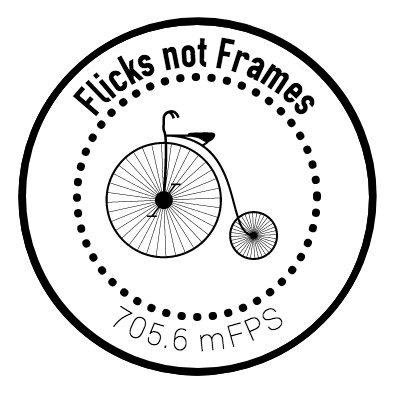

[](https://travis-ci.org/nothingismagick/Flicks)
[](https://coveralls.io/github/nothingismagick/node-flicks?branch=master)


Flicks is a compact, straightforward, stand-alone, test-driven and eslinted ES6 compatible node module created for doing useful calculations with Flicks for media production pipelines, such as checking to see if a point in time can be referenced within a "Flick" ratio boundary, counting with Flicks and even helping with advanced syncing problems in browser playback. Given a frequency and a number of Flicks, it will even render out a time code in the short form of `[ww:dd:hh:mm:ss.ff(ffff)]` or as JSON-type object with these values as NUMBERS.

It should work in node just as it should work in the browser, as the Flicks object is exposed with both node.js and commonjs export approaches.

Please visit [OculusVR/flicks](https://github.com/OculusVR/Flicks) and give them a star. That little lib is the original C++ version you'll want for high-performance applications. We are mostly concerned with the userland application of Flicks here - especially helping the user decide upon a mixture of fps, Hz and BPM.

## Quick-Start

We have provided you with a file: `quickstart.js` that you can use without installing anything. After you have cloned (or forked this repo) to your local machine, just type: 

```
node quickstart.js
```

It will run a couple of examples of interesting applications of this code and output them to console.log()


##Design 

We have chosen to expose a lookup table as an object that holds all of the most common values for frequencies that you would like to measure in Flicks. It is available at `Flicks._LU` - but as with the following `Flicks._SI` object, it is primarily meant to be used internally. You can still perform a lookup with either `Flicks._LU[30]` or `Flicks._LU['30']` for example, which will hold the value of 23520000. All of the evenly divisible frequencies up to 25 are included here - and if you like you can have the whole object with `Flicks._LU`.

We have furthermore extended the original idea of Flicks to shorten Flicks when displayed - because the number of Flicks gets really big and no one likes to see a number like 2352000000000000000000 (which as a quantity of time measured in Flicks is 317097.92 years of video - or rather a little bit longer than the length of time it would take to watch all of the videos on Youtube) and 2.352 zetta-Flicks (or ≈2.3 zF) just seems like a logical and concise way to do it. Furthermore, using this notation when talking about Flicks instead of Frames is a visual reminder to the user that FPS and f/s are not the same as kF/s or kFPS. To this end we are exposing another internal object with these names and abbreviations. It is available at `Flicks._SI`


On a side note, 2.352e21 Flicks makes as much sense as 2.352 zF - and from a technical point of view it is indeed faster to pass a number than a string that has to be parsed. This approach will always work in the code, but for many non-technical end-users that invocation of scientific notation will look strange.

As a matter of procedure (and keeping in step with the original spec), we count frames as ticks. We make the assumption that these ticks have an exact, immutable length that is its frequency. Frequency is commonly counted in video as frames per second (fps), in music as beats per minute (BPM) and audio recordings are commonly made using some number of cycles per second or Hertz (Hz). We capitalize the word "Flicks" and abbreviate it with "F", and speak of FlickTicks "FT" when we are counting them instead of referring to them as mere ratios.


## Background
A Flick (frame-tick) is a very small unit of time. It is 1/705600000 of a second, exactly.

`1 Flick = 1/705600000 second`

This unit of time is the smallest time unit which is LARGER than a nanosecond, and can in integer quantities exactly represent a single frame duration for 24 Hz, 25 Hz, 30 Hz, 48 Hz, 50 Hz, 60 Hz, 90 Hz, 100 Hz, 120 Hz, and also 1/1000 divisions of each, as well as a single sample duration for 8 kHz, 16 kHz, 22.05 kHz, 24 kHz, 32 kHz, 44.1 kHz, 48 kHz, 88.2 kHz, 96 kHz, and 192kHz, as well as the NTSC frame durations for 24 * (1000/1001) Hz, 30 * (1000/1001) Hz, 60 * (1000/1001) Hz, and 120 * (1000/1001) Hz.

Flicks also support some common audio sample rates as well. This list is not exhaustive, but covers the majority of digital audio formats. They are 8kHz, 16kHz, 22.05kHz, 24kHz, 32kHz, 44.1kHz, 48kHz, 88.2kHz, 96kHz, and 192kHz.

NTSC IS NOT EXPLICITLY SUPPORTED IN ALL OF ITS SUBTLE NUANCES, BUT: The NTSC variations (~23.976, ~29.97, etc) are approximately defined as 24 * 1000/1001 and 30 * 1000/1001, etc. These can be represented exactly in Flicks, but 1/1000 divisions are not available.


## Details 

Here are some of the frequencies and their values.

```
- 24    fps frame: 29400000 Flicks / 29.400 mF
- 25    fps frame: 28224000 Flicks / 28.224 mF
- 30    fps frame: 23520000 Flicks / 23.520 mF
- 48    fps frame: 14700000 Flicks / 14.700 mF
- 50    fps frame: 14112000 Flicks / 14.112 mF
- 60    fps frame: 11760000 Flicks / 11.760 mF
- 90    fps frame: 7840000 Flicks  / 7.840 mF
- 100   fps frame: 7056000 Flicks  / 7.056 mF
- 120   fps frame: 5880000 Flicks  / 5.880 mF
- 144    hz frame: 4900000 Flicks  / 4.90 mF   
- 8000   hz frame: 88200 Flicks    / 88.2 kF
- 16000  hz frame: 44100 Flicks    / 44.1 kF
- 22050  hz frame: 32000 Flicks    / 32.0 kF
- 24000  hz frame: 29400 Flicks    / 29.4 kF
- 32000  hz frame: 22050 Flicks    / 22.05 kF
- 44100  hz frame: 16000 Flicks    / 16.0 kF
- 48000  hz frame: 14700 Flicks    / 14.7 kF
- 88200  hz frame: 8000 Flicks     / 8.0 kF
- 96000  hz frame: 7350 Flicks     / 7.35 kF
- 192000 hz frame: 3675 Flicks     / 3.675 kF
```

## Installation & Usage


If you want to use it in a node project, you would:

```
yarn add flicks
```
Or if you are still using npm:

```
npm install flicks --save
```

This is an example of how you would require the module in your node.js project.
```
let Flicks = require('Flicks')

console.log(Flicks._per_second)
```
This will return the number `705600000` 

You should always use the try / catch approach for this kind of math, because we are pretty aggressive about catching errors early and will throw down at the drop of a hat. ;) 

## Docs

We created the docs with the über-awesome [JSdoc3](http://usejsdoc.org/) and using the [foodoc template](https://github.com/steveush/foodoc). You can see them [here](https://nothingismagick.github.io/Flicks).

## What the FAQ?

Very sorry to hear that, but it is one of those things that you have to figure out a use for. If you have found a bug, please report it clearly in Issues - along with OS, Node version and anything descriptive of what you were doing. Unfortunately, we cannot support you in implementation. This is free software, not free support.

## 32-bit

Using this with 32bit? We are interested in hearing from you about how you are using this module - and especially if you are **NOT** having problems on 32-bit x86 or ARM platforms.

## Tests

To run the test battery (at the time of this writing there are 25 tests) you can simply use: `npm test`

We are using eslint to pretest our linting and mocha for the actual tests. If you have found an edge case that we didn't detect, please write a test for it, fix the problem and make a pull-request. Thankyou!

## Semver
We solemnly swear never to change the inputs and outputs of existing functions - i.e. there will never be a version two of this module. If we need something different, we'll write a new module.

## Contributing

We consider this module to be complete for our purposes. As stated above, we will not change the inputs or outputs of existing functions. If there is a way to internally improve the functions without changing the API, then it *might* be considered. If you really have a need to fix something, then please - fork away. 

## Acknowledgements
This time unit began as a technical question posted publicly on Facebook by Christopher Horvath in late 2016. Many people contributed and refined the unit, including Dan Goldman, Pascal Pincosy, Simon Eves, Kearsley Higgins, Francisco De La Torre, Benjy Feen, Eric Landreneau and Sebastian Sylwan, among others. [Here's the post!](https://www.facebook.com/christopher.horvath.395/posts/1157292757692660)

Some of this readme is taken from the original repository: https://github.com/OculusVR/Flicks
 
## License
All original code here can be used in accordance with the MIT license. Readme and Docs: CC-BY

Proudly sponsored by the [KINOÏT Platform](http://kinokabaret.com)
